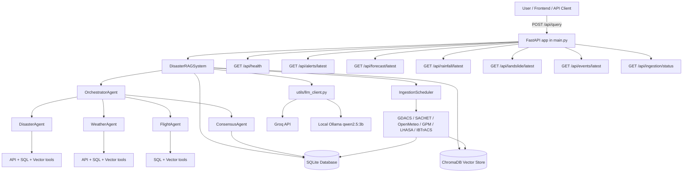

# DisasterRAG System Pipeline and Architecture Guide

This document explains the entire system from the perspective of someone who is new to the project.

It covers the runtime flow, background services, APIs, database behavior, agent behavior, LLM routing, offline fallback, and the future fine-tuning loop.

The goal is to make the project understandable without needing to read every source file first.

If you are new to this repo, read the sections in order.

If you already know the basics, jump to the execution trace, the API section, or the fine-tuning section.

The project is a multi-agent disaster intelligence system.

It combines FastAPI, CrewAI, DSPy, SQLite, ChromaDB, and Ollama.

It can also use Groq as a primary cloud model provider.

The local Ollama model is the offline fallback.

The system is designed to answer questions about flights, weather, and disasters.

It can also combine those domains when a query spans more than one area.

The main orchestrator is the brain of the app.

The flight, weather, and disaster agents are the domain specialists.

The consensus agent merges multi-agent findings into a final answer.

The scheduler runs background ingestion jobs.

The database stores structured operational data.

The vector database stores embeddings for semantic retrieval.

The LLM client chooses between Groq and Ollama.

The rest of this document explains how those pieces interact.

## Architecture Diagram

## What the Diagram Means

The user sends a query to the FastAPI app.

FastAPI creates or reuses the singleton DisasterRAGSystem.

The system loads the database manager, vector manager, LLM client, agents, orchestrator, and scheduler.

The orchestrator decides which agent should handle the query.

The chosen agent uses tools to fetch real evidence.

The agent then uses DSPy to shape the response.

If the query needs more than one agent, the consensus agent synthesizes the answer.

If Groq is unavailable, the LLM client falls back to local Ollama.

If the app restarts, the background ingestion scheduler also restarts.

That scheduler keeps the database fresh by polling external sources.

The database and vector store are the persistent memory of the system.

The runtime never depends on only one source of truth.

That is why the app can survive rate limits and partial outages.

## Reading Guide

The next section explains the startup path.

The section after that explains the request path.

After that, you will see the ingestion path.

Then you will see each agent and the tools it uses.

Then you will see the LLM provider logic.

Then you will see the database layer.

Then the training and fine-tuning path.

Then the error handling path.

Then the offline-only path.

Finally, there is a glossary and a trace-style walkthrough.

## Startup Sequence

001. The user launches the application with `python main.py` or through Uvicorn.

002. Python imports `main.py` and adds the project root to `sys.path`.

003. The FastAPI app object is created immediately.

004. CORS middleware is attached for the local frontend ports.

005. Colorama is initialized so the terminal output looks readable on Windows.

006. The `DisasterRAGSystem` singleton is not created yet.

007. The first request or startup event triggers `get_system()`.

008. `get_system()` checks whether the singleton already exists.

009. If not, it creates a new `DisasterRAGSystem()`.

010. The system prints a visual banner in the terminal.

011. The system initializes the database manager first.

012. The database manager opens or creates the SQLite database.

013. The database schema is checked or created.

014. Tables for aircraft, weather events, disaster events, and correlations are prepared.

015. Indexes are created for faster lookup.

016. The vector database manager is initialized next.

017. ChromaDB collections are loaded or created.

018. The LLM client is initialized after the databases.

019. The client checks the configured provider mode.

020. The client tries Groq first when configured for primary-cloud mode.

021. The client stores Ollama settings for fallback or local-only use.

022. The flight agent is initialized after the LLM client.

023. The weather agent is initialized after the flight agent.

024. The disaster agent is initialized after the weather agent.

025. The consensus agent is initialized after the domain agents.

026. The orchestrator agent is built with references to all sub-agents.

027. The ingestion scheduler is constructed with the database manager.

028. At the end of initialization, the system prints success.

029. The app is now ready to answer queries and run background jobs.

030. If FastAPI startup is active, the scheduler begins polling.

031. If the app is run interactively, a CLI loop is available.

032. If the app is used through the API, `/api/query` becomes the main entry point.

033. The startup path is intentionally deterministic.

034. Nothing depends on a browser before the backend is ready.

035. Nothing depends on a request arriving before the stores exist.

036. This reduces boot-time failures.

037. It also makes debugging easier.

038. The initialization order matters because later components depend on earlier ones.

039. The agents need the database and vector store.

040. The orchestrator needs the agents.

041. The scheduler needs the database.

042. The API layer needs the system singleton.

043. The application can be started from the command line or through Uvicorn.

044. The code supports both interactive mode and web mode.

045. In interactive mode, the user types directly into the terminal.

046. In web mode, the frontend sends JSON to the backend.

047. The same core runtime handles both paths.

048. That is why the application logic is centralized in `DisasterRAGSystem`.

049. The system object is the single entry point for most operations.

050. The system object owns the data stores and the orchestration flow.

## Request Path

051. A user query arrives at the backend.

052. The `/api/query` endpoint receives the payload.

053. The endpoint extracts the `query` field from the JSON body.

054. If the query field is missing, the API returns an error.

055. If the query exists, the backend loads the singleton system.

056. The system processes the query through the orchestrator.

057. The orchestrator first classifies the query.

058. The classification step decides the primary domain.

059. The primary domain is usually flight, weather, or disaster.

060. The classification step also decides whether secondary agents are needed.

061. If the query is simple, one agent may be enough.

062. If the query is complex, the orchestrator decomposes it.

063. Decomposition creates sub-queries for each relevant agent.

064. The orchestrator builds an execution order.

065. The system then sends each sub-query to the matching agent.

066. Each agent receives the query and any context from previous agents.

067. Each agent uses tools to fetch factual evidence.

068. The CrewAI agent is expected to use at least one tool.

069. The tools may query SQLite, ChromaDB, or external APIs.

070. If the CrewAI execution works, the agent gets a raw result.

071. If CrewAI fails, the agent falls back to direct tool access.

072. After the raw result is collected, DSPy shapes the answer.

073. DSPy returns structured output with the final answer text.

074. The orchestrator stores the result under the agent name.

075. If the query needs re-invocation, the orchestrator tries again.

076. Re-invocation happens when the result is weak or incomplete.

077. If the query needs consensus, the consensus agent runs.

078. Consensus merges multi-agent evidence into one response.

079. The final response is returned to the API caller.

080. The response object includes metadata about the routing and fallback.

081. The metadata helps debugging and future training.

082. The request path is synchronous from the API perspective.

083. Internally, the tools and agents may invoke network requests.

084. That is why the response can take a few seconds.

085. The request path is the main user-facing path.

086. It is the path used by the frontend chat interface.

087. It is also the path used by the benchmark scripts.

088. It is the path used by manual testing.

089. It is the path that most clearly shows system behavior.

090. If anything fails here, the user feels it immediately.

091. That is why this path is heavily instrumented.

092. The orchestrator prints classification details to the terminal.

093. Each agent prints its own processing message.

094. The scheduler and database components log their activity too.

095. The response is not just text.

096. It is a structured result with answer, metadata, and state.

097. That structure is useful for training later.

098. It is also useful for analysis and evaluation.

099. The request path is the backbone of the entire project.

100. Everything else supports this one path.

## Background Ingestion Path

101. The ingestion scheduler starts during FastAPI startup.

102. It does not block the main server thread.

103. It creates asynchronous polling tasks.

104. Each task runs one source on its own schedule.

105. OpenMeteo, SACHET, and GDACS are part of the first wave.

106. GPM, LHASA, and IBTrACS are optional or slower sources.

107. The scheduler imports sources lazily.

108. If a source file is missing, the scheduler skips it.

109. That keeps the system booting even when some ingestors are absent.

110. Each ingestor runs in a thread executor.

111. This avoids blocking the event loop.

112. Each ingestor fetches raw data from its source.

113. The ingestor normalizes or stores that data.

114. Structured rows are inserted into SQLite.

115. Relevant text is embedded and stored in ChromaDB.

116. The scheduler then sleeps until the next cycle.

117. The polling interval is controlled by config.

118. Different sources poll at different rates.

119. Some sources are updated every few minutes.

120. Some sources are updated every few hours.

121. IBTrACS is handled very infrequently.

122. Retention jobs also run as part of the scheduler.

123. Retention removes or archives old data.

124. This helps the edge deployment stay light.

125. Background ingestion is how the system stays current.

126. It reduces dependence on fresh API calls during user queries.

127. It also makes offline or degraded mode more useful.

128. Ingestion is a major reason the app can answer quickly.

129. The query path reads already-ingested data.

130. The background path keeps that data fresh.

131. These two paths work together.

132. If ingestion fails, the query path can still use what is already stored.

133. If the query path fails, the ingestion path still continues.

134. The two systems are decoupled.

135. That is a good design choice for unreliable environments.

136. The scheduler is one of the most important background services.

137. Without it, the database would go stale.

138. Stale data would reduce answer quality.

139. Stale data would also harm fine-tuning later.

140. The scheduler creates a continuous refresh loop.

141. The loop is simple but effective.

142. Fetch, normalize, store, sleep, repeat.

143. The scheduler is not a queue worker.

144. It is a polling loop manager.

145. That makes it easy to understand and debug.

146. It also keeps the implementation lightweight.

147. The app does not need Kafka or Celery for this stage.

148. SQLite and asyncio are enough for the current scope.

149. The scheduler is started and stopped with the app lifecycle.

150. That keeps background tasks tied to the server lifecycle.

151. When the server shuts down, tasks are cancelled cleanly.

152. That prevents duplicate ingestors on restart.

153. It also reduces resource leaks.

154. Background ingestion is the hidden engine behind the answer quality.

155. It keeps the model grounded in fresh data.

156. The rest of the guide builds on this idea.

157. Next comes the agent system in detail.

158. Then we will connect the agent behavior back to the data stores.

159. Then we will connect everything to fine-tuning.

160. After that, you will have a full mental model.

161. The query starts at the API.

162. The API hands work to the orchestrator.

163. The orchestrator decomposes the query.

164. The agent chooses tools.

165. The tools query data sources.

166. The evidence is summarized.

167. The consensus agent merges multi-domain data.

168. The final response returns to the client.

169. The background scheduler keeps the stores current.

170. The offline model handles local fallback.

171. The database stores structured facts.

172. The vector store stores semantic memory.

173. The whole system is a loop, not a one-shot call.

174. That loop is what makes the app an agentic RAG system.

175. The next sections explain the agent loop in detail.

176. The details matter because they are the future training signals.

177. Every tool call becomes potential supervision.

178. Every fallback becomes potential negative data.

179. Every consensus decision becomes potential preference data.

180. That is why the trace design matters so much.

## Orchestrator Deep Dive

181. The orchestrator is the traffic controller for user queries.

182. It does not answer questions by itself.

183. It decides which specialized agent should answer.

184. It also decides whether more than one agent is needed.

185. It uses DSPy classifiers to structure that decision.

186. The first classification output is `query_type`.

187. A simple query usually needs one agent.

188. A complex query usually needs multiple agents.

189. The second classification output is `primary_agent`.

190. The primary agent is usually flight, weather, or disaster.

191. The third output is `secondary_agents`.

192. Secondary agents are used when a query spans domains.

193. The fourth output is `requires_cross_intelligence`.

194. That flag tells the system whether consensus may be needed.

195. The orchestrator keeps all sub-agent objects in one registry.

196. This makes routing direct and easy to inspect.

197. It also makes fallback behavior easier to implement.

198. The orchestrator can call each agent one by one.

199. It can also re-invoke an agent if the first pass was weak.

200. That re-invocation loop improves answer quality.

201. The orchestrator records the start time at the beginning.

202. It uses that timestamp to compute total latency.

203. Latency matters because some queries go through many tools.

204. A simple weather query should be fast.

205. A multi-agent disaster assessment will be slower.

206. The orchestrator first prints the query for debugging.

207. Then it calls `_classify_query`.

208. The classifier is a DSPy predictor.

209. DSPy returns a structured object, not free text.

210. That makes the routing step more reliable.

211. If classification fails, the system falls back to a default.

212. The default is usually the flight agent.

213. The default is chosen because the system must always return something.

214. After classification, the orchestrator decomposes the query.

215. Decomposition splits one user query into focused sub-queries.

216. Each sub-query is easier for one agent to handle.

217. For example, one sub-query can ask for weather.

218. Another can ask for disaster conditions.

219. Another can ask for flight exposure.

220. If decomposition fails, the system reuses the original query.

221. The next step is agent execution.

222. The orchestrator decides the execution order.

223. Usually the primary agent is first.

224. Secondary agents run after the primary.

225. Context from earlier agents is passed forward.

226. That context helps later agents reason in the right frame.

227. Each agent is called with retry logic.

228. The retry logic protects against temporary failures.

229. A failed tool call is not always fatal.

230. The orchestrator can retry a few times.

231. The result is checked for useful content.

232. If the answer is empty or error-like, the system tries again.

233. If all retries fail, the system returns a partial or failed result.

234. The orchestrator then evaluates the gathered results.

235. DSPy can suggest re-invocation for weak results.

236. A weak result may mean a tool was missed.

237. It may also mean a sub-query was too broad.

238. Re-invocation creates a second chance for the agent.

239. The query can be rewritten to be more precise.

240. This is especially useful for complex disaster questions.

241. After agent execution and re-invocation, the orchestrator decides whether consensus is needed.

242. Consensus is needed when multiple domains matter together.

243. A good example is flight safety during severe weather.

244. Another example is disaster relief under active alerts.

245. In those cases, one agent’s answer is not enough.

246. The consensus agent merges the evidence.

247. The final answer should read like one coherent assessment.

248. The orchestrator adds metadata to the final response.

249. The metadata records which agents were used.

250. It also records whether consensus was applied.

251. It records whether the orchestrator was primary or fallback.

252. The metadata is useful for debugging and training.

253. The orchestrator is also where future logging should be added.

254. Every query trajectory should start here.

255. Classification, decomposition, routing, retries, and consensus are the key trajectory events.

256. These are the events you will want to replay later for fine-tuning.

257. The orchestrator is therefore both a router and a data generator.

258. That dual role is central to this project.

259. The next section explains the flight agent.

260. The flight agent handles aircraft and aviation risk questions.

## Flight Agent Deep Dive

261. The flight agent is responsible for aviation-related queries.

262. It handles aircraft tracking, aircraft search, and emergency identification.

263. It uses CrewAI to decide which flight tools to call.

264. It uses DSPy to turn raw tool output into a structured answer.

265. It is initialized with the database and vector store.

266. The SQL tool gives it access to structured flight records.

267. The vector store gives it semantic search over flight knowledge.

268. The agent wraps those capabilities into CrewAI tools.

269. One tool gets all recent flights.

270. One tool gets a flight by callsign.

271. One tool gets a flight by hex identifier.

272. One tool finds flights in a geographic area.

273. One tool identifies emergency squawks.

274. One tool traces flight trajectory history.

275. One tool finds flights near a location.

276. One tool performs semantic vector search.

277. The CrewAI agent is instructed to always use tools.

278. That instruction is important for grounding.

279. The system should never answer flight questions from pure memory alone.

280. The flight agent process begins by printing the query.

281. A context string is built from any orchestrator context.

282. A CrewAI task is then created.

283. The task asks the agent to analyze the flight query.

284. The task tells the agent to use tools before answering.

285. The task also requests key aviation details.

286. The agent’s LLM is refreshed before each call.

287. This refresh allows Groq or Ollama switching without a restart.

288. The Crew object is created with the agent and task.

289. The function-calling LLM is also set for tool use.

290. CrewAI then kicks off the task.

291. The result is captured as raw text.

292. If CrewAI fails, the agent falls back to direct queries.

293. The fallback path still tries to produce useful evidence.

294. The fallback may use vector search first.

295. It may then use the SQL database for recent flights.

296. The fallback is important when tool calling breaks.

297. After raw output is collected, DSPy summarizes it.

298. The response predictor formats the final answer.

299. The final result includes answer, raw output, and status.

300. The status can be success, partial, or failed.

301. The flight agent is strong at local flight surveillance.

302. It is especially useful near Mangalore airspace.

303. It can detect emergency-related patterns.

304. It can combine database facts with vector memory.

305. It can also support broader disaster planning.

306. For example, it can answer whether flights are affected by weather.

307. For another example, it can help identify evacuation-related flight issues.

308. The flight agent is therefore both a tracker and a risk detector.

309. It is not a general-purpose chat model.

310. It is a specialized evidence-gathering worker.

311. The same pattern appears in the weather agent.

312. The weather agent has more external API dependencies.

313. The weather agent is explained next.

## Weather Agent Deep Dive

314. The weather agent handles forecast and condition queries.

315. It also handles rainfall, landslide, and maritime weather questions.

316. It uses both API tools and database tools.

317. It also uses vector search for semantic retrieval.

318. The weather agent wraps current weather, forecast, and regional tools.

319. It can query current weather by coordinates.

320. It can query weather by city.

321. It can request forecast data for a location.

322. It can query weather events stored in SQLite.

323. It can search weather knowledge semantically.

324. It can also use Open-Meteo forecast rows.

325. It can inspect precipitation-heavy periods.

326. It can retrieve GPM rainfall observations.

327. It can retrieve heavy rainfall rows.

328. It can retrieve landslide snapshots.

329. It can retrieve high-risk landslide cells.

330. Those tools let it answer layered weather risk questions.

331. The agent starts with the database and vector store.

332. It also creates a WeatherAPITool for live weather APIs.

333. It creates special SQL tools for forecast, rainfall, and landslide data.

334. Those tools come from ingested data, not just live APIs.

335. That means the agent can answer from stored data even when the API is slow.

336. The weather agent also uses CrewAI.

337. The goal tells the model to gather real data before answering.

338. The backstory tells it to behave like a meteorologist and analyst.

339. A Crew task is created for the query.

340. The task includes the query and any context.

341. The task asks the agent to use the available tools.

342. The agent LLM is refreshed before execution.

343. The Crew is then launched.

344. If CrewAI fails, the fallback path is direct tool querying.

345. The fallback can still assemble useful evidence.

346. After raw output is collected, DSPy turns it into a structured response.

347. The weather agent may say current conditions.

348. It may summarize forecast windows.

349. It may mention rainfall intensity.

350. It may mention landslide probability.

351. It may connect weather to aviation safety.

352. It may connect weather to disaster response logistics.

353. The weather agent is often the source of early warning details.

354. Those details matter for both disaster and flight agents.

355. The weather agent can be used alone or as part of consensus.

356. It is especially important for queries that mention rain, wind, or future conditions.

357. The weather agent is a great example of a domain-specific worker.

358. It is not just a wrapper around a forecast API.

359. It blends live API calls, cached database rows, and semantic retrieval.

360. The disaster agent follows the same layered pattern.

## Disaster Agent Deep Dive

361. The disaster agent handles alerts, disaster events, and historical patterns.

362. It is the main worker for evacuation and logistics questions.

363. It can read both live APIs and stored disaster rows.

364. It can also inspect vector search results for semantic clues.

365. It exposes tools for active events and category-based event search.

366. It can retrieve geographic disaster events.

367. It can inspect event details by ID.

368. It can query historical disasters from the database.

369. It can inspect recent disasters from the last few days.

370. It can search the disaster vector knowledge base.

371. It can retrieve official alerts from SACHET or NDMA-style data.

372. It can retrieve active alerts that are not expired.

373. It can retrieve GDACS events.

374. It can retrieve GDACS severity-filtered events.

375. It can retrieve historical cyclones.

376. It can retrieve intense cyclones above a threshold.

377. The disaster agent starts like the other agents.

378. It builds a CrewAI agent with a clear goal and backstory.

379. The goal says to use tools before answering.

380. The backstory says to act as an emergency management expert.

381. That framing helps tool selection.

382. The query is wrapped in a CrewAI task.

383. The task can include orchestrator context.

384. The task asks for meaningful disaster findings.

385. The agent’s LLM is refreshed before execution.

386. The Crew is launched with function-calling support.

387. If the CrewAI path fails, direct tools are used.

388. That fallback is important because disaster questions are urgent.

389. The raw output is then sent through DSPy.

390. DSPy generates a cleaner response.

391. The answer may summarize active alerts.

392. It may mention region-specific event types.

393. It may discuss severity and operational risk.

394. It may suggest preparedness or evacuation logic.

395. It may connect disaster data to weather and flight impact.

396. The disaster agent is the most operations-heavy worker.

397. It often retrieves many overlapping signals.

398. It is a natural place for multi-source reasoning.

399. It is also a strong candidate for future fine-tuning.

400. The quality of its tool selection matters a lot.

401. The quality of its grounding matters a lot.

402. The quality of its answer structure matters a lot.

403. The disaster agent often produces the best evidence for consensus.

404. It is the agent most likely to answer whether a region is currently at risk.

405. It is also the agent most likely to identify historic analogs.

406. Historic analogs are useful for disaster planning.

407. The disaster agent therefore connects current state with prior patterns.

408. This makes it essential for trend analysis.

409. It also makes it essential for synthetic dataset generation later.

410. Now the consensus agent enters the picture.

## Consensus Agent Deep Dive

411. The consensus agent is used when one agent is not enough.

412. It takes outputs from multiple agents.

413. It synthesizes them into one coherent response.

414. It is especially useful for cross-domain disaster questions.

415. A good example is weather plus flight plus disaster risk.

416. Another example is rain plus landslide plus evacuation planning.

417. The consensus agent uses DSPy.

418. It does not try to replace the domain agents.

419. It only merges and reasons over their results.

420. This is an important design boundary.

421. The consensus agent reads the original query.

422. It also reads the outputs from the participating agents.

423. It can also read extracted key data.

424. It can inspect correlations between findings.

425. It can inspect geographic context.

426. It can inspect severity assessments.

427. It then generates a final emergency command style response.

428. The response is meant to be operationally useful.

429. It should not just restate the raw data.

430. It should connect the dots.

431. The consensus path is important for query categories C and D.

432. Those categories are the multi-agent and decomposition-heavy cases.

433. The orchestrator decides when consensus is needed.

434. The consensus agent then becomes the final synthesis layer.

435. If consensus is not needed, the primary agent answer can be returned directly.

436. Consensus adds latency, but it can add quality too.

437. It is worth using when cross-domain risk is real.

438. It is less useful for simple single-agent queries.

439. The benchmark metrics show where consensus helps and where it slows things down.

440. That makes consensus a tunable tradeoff.

441. The consensus agent is one of the strongest future training targets.

442. It can teach the model how to merge evidence rather than just retrieve facts.

443. The next section explains the LLM provider layer.

## LLM Provider Layer

444. The LLM provider layer decides which model backend is active.

445. The project currently supports Groq and Ollama.

446. Groq is used as the primary cloud provider.

447. Ollama is used as the local fallback.

448. This means the app can survive internet failure better.

449. It also means the app can run in offline mode.

450. The LLM client stores the provider mode from config.

451. The client also stores the Groq model name.

452. The client also stores the Ollama base URL.

453. The client also stores the Ollama model name.

454. The provider can be switched by environment variable.

455. If the provider is set to Ollama, Groq is skipped.

456. If the provider is set to Groq, the client tries Groq first.

457. If Groq throws a rate-limit or connection-like error, fallback begins.

458. The client marks Groq as temporarily unavailable.

459. A cooldown timer is started.

460. During cooldown, Ollama is used instead.

461. Once the cooldown expires, Groq can be tried again.

462. This allows automatic recovery after a temporary cloud problem.

463. The client also configures DSPy for the active provider.

464. DSPy can point at `groq/...` or `ollama_chat/...`.

465. This is important because the agents rely on DSPy.

466. The client also builds CrewAI-compatible LLM objects.

467. Those LLM objects are refreshed inside each agent before execution.

468. That makes the provider switching dynamic.

469. The user does not need to restart the app to switch models.

470. The provider layer is one of the most important reliability features.

471. It directly supports the offline requirement.

472. It also supports free-tier cloud rate limit recovery.

473. It is better than hardcoding one provider forever.

474. The local Ollama model is especially useful on the Raspberry Pi target.

475. It is also useful on the laptop when the internet is unstable.

476. The provider layer is the bridge between cloud and edge.

477. It is central to the project’s resilience story.

478. The next section explains the database and vector stores.

## Data Storage Layer

479. The SQLite database is the structured memory of the system.

480. It stores aircraft, weather, disaster, and correlation data.

481. It also stores ingestion logs and source metadata.

482. SQLite is a good fit for this project because it is lightweight.

483. It can run on a laptop, a desktop, or a Raspberry Pi.

484. The tables are designed for query speed and simple updates.

485. The aircraft table stores ADS-B data.

486. The weather table stores weather events and forecast rows.

487. The disaster table stores disaster events and official alerts.

488. The correlations table stores cross-domain relationships.

489. The vector database stores semantically searchable documents.

490. ChromaDB is used for that semantic layer.

491. The vector collections are organized by domain.

492. There are flight, weather, and disaster collections.

493. The ingestion scheduler populates both stores.

494. The query agents read from both stores.

495. SQLite gives exact facts and filters.

496. ChromaDB gives similar-meaning search.

497. The two together provide both precision and recall.

498. This combination is very useful in disaster reasoning.

499. For example, exact alerts can be found in SQLite.

500. Similar past events can be found in ChromaDB.

501. The app uses the database to answer quickly.

502. The app uses the vector store to enrich answers.

503. The app also uses both to build training data later.

504. The stored data is not just for answering.

505. It is also for learning.

506. That is why the storage layer matters so much.

507. Data quality here affects both runtime and fine-tuning.

508. The next section explains how the API endpoints expose the system.

## API Surface

509. The main query endpoint is `POST /api/query`.

510. It accepts a JSON object with a `query` field.

511. It returns the orchestrator result object.

512. The health endpoint is `GET /api/health`.

513. It returns a simple OK status.

514. The health endpoint helps deployment checks.

515. The alerts endpoint is `GET /api/alerts/latest`.

516. It can accept `limit` and `district` parameters.

517. The forecast endpoint is `GET /api/forecast/latest`.

518. It can accept `limit` and `location` parameters.

519. The rainfall endpoint is `GET /api/rainfall/latest`.

520. It accepts a `limit` parameter.

521. The landslide endpoint is `GET /api/landslide/latest`.

522. It accepts a `limit` parameter.

523. The events endpoint is `GET /api/events/latest`.

524. It can accept `limit` and `event_type` parameters.

525. The ingestion status endpoint is `GET /api/ingestion/status`.

526. It shows recent source activity.

527. These endpoints are useful for debugging and dashboards.

528. The frontend mainly uses `/api/query`.

529. The other endpoints are mostly inspection tools.

530. The API layer is thin by design.

531. It delegates business logic to the system object.

532. That keeps HTTP concerns separate from agent logic.

533. The route handlers are simple and predictable.

534. This reduces bug surface area.

535. The next section explains how the data flows through the system.

## End-to-End Data Flow

536. A user starts with a natural-language question.

537. The frontend sends that question to the backend.

538. The backend receives the query in `/api/query`.

539. The system singleton is reused if it already exists.

540. The orchestrator classifies the query.

541. The orchestrator decides the primary and secondary agents.

542. The orchestrator decomposes the query if necessary.

543. Each selected agent receives its own sub-query.

544. Each agent runs tools to gather evidence.

545. The tools may call SQL, vector search, or live APIs.

546. The agent captures a raw evidence payload.

547. DSPy converts the raw output into a cleaner response.

548. The orchestrator may ask for a second pass if the result is weak.

549. If the query spans domains, consensus is applied.

550. The final response is returned to the API caller.

551. Meanwhile, the scheduler continues refreshing the database.

552. Fresh data improves future query quality.

553. The whole app is a closed loop.

554. User question in, structured answer out.

555. Background ingestion in, fresher memory out.

556. Traces in, better future models out.

557. That is the design pattern you should keep in mind.

## Fine-Tuning Loop

558. Fine-tuning should not happen inside the live request path.

559. Training should happen offline.

560. The live app should only serve queries and log traces.

561. The first training input is the trajectory log.

562. A trajectory log records the full path of one query.

563. It should include the query, routes, tools, outputs, and result.

564. It should also include whether fallback was needed.

565. It should also include whether consensus was used.

566. It should also include user feedback when available.

567. The second training input is the benchmark data.

568. Benchmark runs are useful because they are repeatable.

569. They give you known queries across known categories.

570. The third training input is synthetic data.

571. Synthetic data is useful when live traces are still small.

572. Synthetic planner examples teach routing.

573. Synthetic answer examples teach response structure.

574. Synthetic preference pairs teach ranking.

575. The preferred method for this project is DPO or ORPO.

576. Those methods work well with paired data.

577. They are easier than full RL.

578. They are also easier to run locally.

579. A 3B model fits this kind of preference tuning better than large RL.

580. Once the model is fine-tuned, export it to a deployable format.

581. For Ollama, that usually means a GGUF or imported local model.

582. After export, the model is registered with a version name.

583. The app then points to that new version in config.

584. If the new model is weak, you can roll back.

585. That is why versioning matters.

586. The fine-tuning loop should be periodic, not constant.

587. Collect enough data first.

588. Then train in batches.

589. Then evaluate.

590. Then promote the model if it improves metrics.

591. That cycle should repeat over time.

592. The next section explains the offline mode.

## Offline Mode

593. Offline mode means the machine has no internet.

594. The Groq API will fail in that case.

595. The LLM client will then use Ollama.

596. The Ollama model must already be downloaded locally.

597. The Ollama daemon must already be running locally.

598. The local model is `qwen2.5:3b` in this repo.

599. That model is the offline fallback brain.

600. Offline mode still allows the app to answer many questions.

601. It works best for queries that can be answered from local data.

602. It also works best when the cache and database are populated.

603. Live external APIs may still fail without internet.

604. That means some weather and disaster sources will be unavailable.

605. The local database becomes even more important in offline mode.

606. The vector store also becomes more important in offline mode.

607. The app can still reason over stored records.

608. The app can still summarize known hazards.

609. The app can still answer about historical patterns.

610. The app can still assist with planning.

611. That is why the ingestion scheduler matters so much before an outage.

612. The better the stored data, the better offline mode behaves.

613. The next section explains failure modes.

## Failure Modes and Recovery

614. The first failure mode is Groq rate limiting.

615. The client marks Groq as temporarily unavailable.

616. Ollama becomes the active provider.

617. The second failure mode is a Groq connection failure.

618. The same fallback logic applies.

619. The third failure mode is CrewAI tool calling failure.

620. The agents then fall back to direct tool querying.

621. The fourth failure mode is a missing or stale database row.

622. The agent may use vector search or another source.

623. The fifth failure mode is an ingestion source outage.

624. The scheduler logs the error and continues.

625. The sixth failure mode is a weak classification.

626. The orchestrator uses default routes or retries.

627. The seventh failure mode is an empty answer.

628. The orchestrator can re-invoke the agent.

629. The eighth failure mode is a multi-agent disagreement.

630. The consensus agent resolves that disagreement.

631. The ninth failure mode is frontend failure.

632. The API still works for direct calls.

633. The tenth failure mode is offline inference failure.

634. In that case the local model or local data may also be missing.

635. The system should be monitored for these cases.

636. Recovery logic is a core feature, not an afterthought.

637. Now comes the beginner mental model.

## Beginner Mental Model

638. Think of the app as a team.

639. The user asks a question.

640. The orchestrator is the team lead.

641. The agents are the specialists.

642. The tools are the instruments.

643. The databases are the notebook and archive.

644. The vector store is the memory of similar cases.

645. The scheduler is the librarian who keeps new material coming in.

646. The LLM client is the switchboard between cloud and local brain.

647. The consensus agent is the editor that combines specialist opinions.

648. The API is the front desk.

649. The frontend is the talking interface for the user.

650. The training pipeline is the system’s homework and exam loop.

651. When you ask the system a question, it does not guess blindly.

652. It tries to fetch evidence.

653. It tries to route correctly.

654. It tries to answer with context.

655. It tries to recover when something fails.

656. It logs enough to improve later.

657. That is the whole idea of the project.

## Suggested Next Implementation Steps

658. Add trajectory logging to the orchestrator.

659. Store the query, agents, tools, outputs, and feedback.

660. Add a feedback API or feedback table.

661. Build an exporter that converts trajectories to JSONL.

662. Train planner SFT on routing examples.

663. Train answer SFT on grounded response examples.

664. Train DPO or ORPO on chosen versus rejected responses.

665. Quantize the fine-tuned model for Ollama.

666. Register the new model under a versioned name.

667. Update config to point at the new version.

668. Re-run the benchmark suite.

669. Compare routing, tool use, and latency.

670. Keep the fallback to the older model if the new one regresses.

671. Expand the dataset to 100 to 120 trajectories first.

672. Later expand to more than 200 if you have enough logs.

673. Add hard negatives where the system chose the wrong tool.

674. Add multi-agent cases where consensus was required.

675. Add offline cases where Ollama handled the request alone.

676. Add failure cases where fallback behavior mattered.

677. That will make the model much better at tool calling.

678. It will also make it better at disaster inference.

679. The next section is a final walkthrough.

## Final Walkthrough in Plain English

680. A user asks a disaster question.

681. The backend receives the question.

682. The orchestrator decides what kind of question it is.

683. The orchestrator decides which specialist should answer.

684. The specialist uses tools to gather data.

685. The specialist may use database rows or live APIs.

686. The specialist may also use semantic search.

687. The raw evidence is turned into a readable answer.

688. If more than one specialist matters, the consensus agent combines them.

689. If the cloud model fails, the local Ollama model takes over.

690. If the model is offline, the database still provides local grounding.

691. If the app is restarted, the scheduler resumes ingestion.

692. If you later log trajectories, those traces become training data.

693. If you later train on those traces, the local model improves.

694. If the model improves, tool calling and disaster reasoning improve.

695. That is the closed loop you want.

696. The system is therefore both a product and a learning system.

697. It answers questions now.

698. It also collects the data needed to answer better later.

699. That is the core architecture story.

700. The project becomes stronger every time the loop runs.

701. Use the orchestrator as the logging anchor.

702. Use the database as the memory anchor.

703. Use the vector store as the similarity anchor.

704. Use Ollama as the offline anchor.

705. Use Groq as the online acceleration anchor.

706. Use benchmarks as the evaluation anchor.

707. Use trajectories as the training anchor.

708. Use DPO or ORPO as the first tuning method.

709. Use richer RL later only if the data and compute justify it.

710. Keep the design simple enough to debug.

711. Keep the traces rich enough to learn from.

712. Keep the fallback paths alive.

713. Keep the model versioned.

714. Keep the ingestion running.

715. Keep the evaluation honest.

716. Keep the offline path working.

717. Keep the consensus layer grounded.

718. Keep the system understandable for new contributors.

719. Keep the data usable for future tuning.

720. Keep the loop closed.

